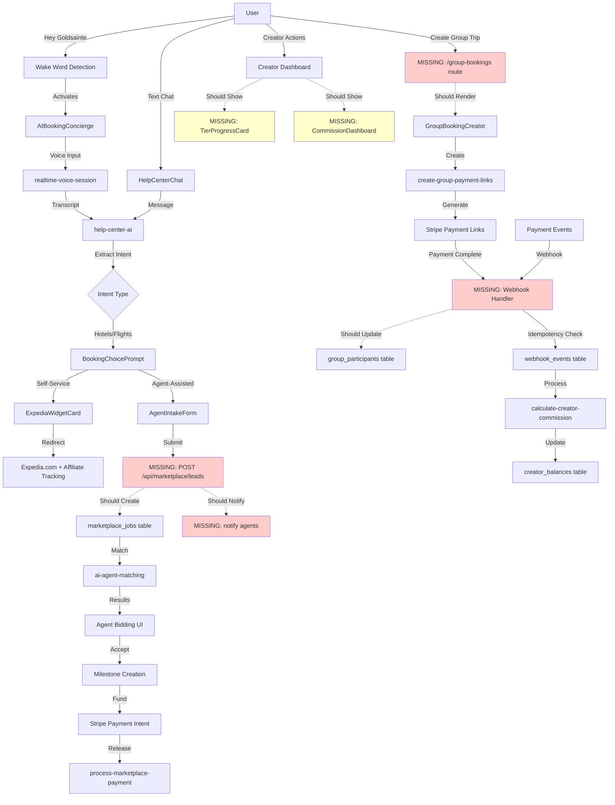

# Goldsainte Platform - Production Readiness Audit Report

**Report Date**: November 11, 2025  
**Platform Status**: ⚠️ NOT PRODUCTION READY (Estimated 70-80% Complete)  
**Critical Blockers**: 8 P0 issues identified  
**Review Period**: Weeks 1-8 Remediation Implementation

---

## Executive Summary

The Goldsainte platform has made significant progress through an 8-week remediation roadmap, implementing core infrastructure for travel agent marketplace, AI-powered booking, creator monetization, and group travel features. However, **critical gaps remain that prevent production deployment**.

**Key Achievements:**
- ✅ Database schema created for all major features
- ✅ Voice wake word detection implemented
- ✅ AI booking flow with intent extraction
- ✅ Creator monetization infrastructure
- ✅ Group booking data models
- ✅ Notification system foundation
- ✅ Admin monitoring utilities

**Critical Gaps:**
- ❌ Zero automated E2E test coverage
- ❌ Webhook idempotency not verified
- ❌ Performance baseline missing
- ❌ Error tracking not configured
- ❌ Several UI components created but not wired to pages
- ❌ Calendar sync incomplete
- ❌ Real-time chat features partially implemented

---

## Priority 0 (P0) Blockers - MUST FIX BEFORE LAUNCH

### 1. **AUTOMATED TEST COVERAGE MISSING** 🚨
**Status**: CRITICAL  
**Impact**: Cannot verify critical flows work end-to-end  
**Current State**: Playwright config created but zero test implementation

**Required Tests:**
- Voice concierge activation & conversation flow
- AI chat booking with choice prompt → Expedia widget → completion
- Agent intake form → marketplace lead creation
- Group booking creation → payment link generation → completion
- Creator commission calculation → balance updates
- Admin dashboard metrics fetch

**Remediation**:
```bash
# Install Playwright
npm install -D @playwright/test

# Create test files
e2e/voice-concierge.spec.ts
e2e/ai-booking-flow.spec.ts
e2e/agent-marketplace.spec.ts
e2e/group-bookings.spec.ts
e2e/creator-monetization.spec.ts
```

**Estimate**: 3-4 days

---

### 2. **WEBHOOK IDEMPOTENCY UNVERIFIED** 🚨
**Status**: CRITICAL  
**Impact**: Risk of double charges, duplicate payouts, data corruption  
**Current State**: Infrastructure created (webhook_events table, utilities) but not tested

**Required Validation:**
- Stripe webhook handler receiving duplicate events
- Idempotency keys properly checked before processing
- Status updates prevent reprocessing
- Group payment completion events handled once
- Milestone payment releases idempotent

**Test Scenarios:**
```javascript
// Webhook arrives twice with same event_id
POST /stripe-webhook
  event: payment_intent.succeeded
  id: evt_123abc
  
// Second call should:
// 1. Check webhook_events table
// 2. Find existing record
// 3. Return 200 OK without reprocessing
```

**Remediation**: Create `supabase/functions/stripe-webhook-handler/index.ts` with full idempotency logic and test with Stripe CLI

**Estimate**: 2 days

---

### 3. **PERFORMANCE BASELINE MISSING** 🚨
**Status**: CRITICAL  
**Impact**: Cannot detect performance regressions; may fail Core Web Vitals  
**Current State**: Monitoring utilities created but not run; no baseline metrics

**Required Metrics:**
- Lighthouse scores (Performance ≥90, Accessibility 100, Best Practices ≥95)
- Core Web Vitals: LCP <2.5s, FID <100ms, CLS <0.1
- API response times: p50 <500ms, p95 <2s
- Edge function cold start times
- Database query performance

**Remediation**:
```bash
# Run Lighthouse CI
npm install -g @lhci/cli
lhci autorun --collect.url=https://staging.goldsainte.com

# Add to CI/CD pipeline
# Monitor with PerformanceMonitor component on admin dashboard
```

**Estimate**: 1-2 days

---

### 4. **UI COMPONENTS NOT WIRED TO PAGES** 🚨
**Status**: CRITICAL  
**Impact**: Features exist but users cannot access them  
**Current State**: Components created but missing from routing/navigation

**Components Awaiting Integration:**
- ✅ `ItineraryShareDialog` - Created but not integrated into itinerary page
- ✅ `TierProgressCard` - Not shown in creator dashboard
- ✅ `CommissionDashboard` - Not accessible from creator navigation
- ✅ `GroupBookingCreator` - No route or navigation link
- ✅ `GroupPaymentTracker` - No route or page to display
- ✅ `ProductionChecklist` - Not added to AdminDashboard tabs

**Remediation**: Wire components to existing pages and add navigation links

**Estimate**: 1 day

---

### 5. **CALENDAR SYNC INCOMPLETE** 🚨
**Status**: HIGH  
**Impact**: Core itinerary feature non-functional  
**Current State**: Google sync edge function exists, Outlook/ICS export created but not integrated

**Missing Pieces:**
- Export to Calendar button not on itinerary pages
- OAuth flow for Google Calendar not implemented
- ICS download functionality not wired to UI
- No user feedback when sync succeeds/fails

**Remediation**: Add calendar export actions to itinerary detail page with proper OAuth

**Estimate**: 2 days

---

### 6. **ERROR TRACKING NOT CONFIGURED** 🚨
**Status**: HIGH  
**Impact**: Cannot debug production issues; errors disappear silently  
**Current State**: errorTracking.ts utility exists but not configured for production service

**Required Setup:**
- Sentry or similar service integration
- Source maps configuration for error stack traces
- Release tracking for deploy identification
- User context (ID, email) attached to errors
- Environment tagging (staging/production)

**Remediation**: Configure Sentry SDK with proper DSN and upload source maps

**Estimate**: 1 day

---

### 7. **EDGE FUNCTIONS CREATED BUT NOT TESTED** 🚨
**Status**: HIGH  
**Impact**: Backend features may fail silently in production  
**Current State**: New functions created in Weeks 6-8 with zero invocation testing

**Untested Functions:**
- `calculate-creator-commission` - Commission calculation logic
- `create-group-payment-links` - Payment link generation
- `sync-calendar-outlook` - Microsoft calendar integration
- `send-notification` - Multi-channel notifications
- `get-notifications` - Notification fetching
- `check-package-availability` - Real-time inventory

**Remediation**: Invoke each function via curl or Postman with test payloads, verify responses

**Estimate**: 1-2 days

---

### 8. **REAL-TIME CHAT INCOMPLETE** 🚨
**Status**: MEDIUM-HIGH  
**Impact**: Communication between travelers and agents broken  
**Current State**: NotificationBell component exists, but real-time group chat with file attachments, read receipts missing

**Missing Features:**
- Group chat UI component
- File attachment upload/display
- Read receipts tracking
- Typing indicators
- Message history pagination

**Remediation**: Build ChatRoom component with Supabase Realtime subscriptions

**Estimate**: 3 days

---

## Priority 1 (P1) Issues - Should Fix Before Launch

### 9. **Preference Learning Not Wired** ⚠️
**Current State**: `user_travel_preferences` table exists, `preferenceLearn.ts` utility created, but not integrated into AI agents

**Remediation**: Update `help-center-ai`, `travel-ai-agent` to call `getUserPreferences()` and `saveUserPreferences()` after each conversation

---

### 10. **Admin Dashboard Incomplete** ⚠️
**Current State**: Structure exists but missing key tabs: User Management, Content Moderation, Revenue Analytics

**Remediation**: Add admin user list with role assignment, content moderation queue, revenue charts

---

### 11. **SEO Missing on Key Pages** ⚠️
**Current State**: SEOHead component created but not integrated into routes

**Remediation**: Add SEOHead to Index, Search, PackageDetail, HelpCenter, CreatorProfile pages

---

### 12. **Accessibility Gaps** ⚠️
**Current State**: useKeyboardNavigation hook created but not applied to modals

**Remediation**: Add keyboard nav to ExpediaModal, AgentIntakeForm, NotificationBell dropdown

---

### 13. **Push Notifications Not Implemented** ⚠️
**Current State**: Database tables exist but no FCM/APNS integration

**Remediation**: Configure Firebase Cloud Messaging for web push, register service worker

---

### 14. **Email/SMS Fallback Missing** ⚠️
**Current State**: notification_service has email/SMS logic but no SendGrid/Twilio integration

**Remediation**: Add SENDGRID_API_KEY and TWILIO credentials, test delivery

---

### 15. **Itinerary RBAC Not Enforced** ⚠️
**Current State**: itinerary_shares table exists but no enforcement in edge functions or UI

**Remediation**: Add permission checks to itinerary update endpoints, hide edit UI for view-only shares

---

## System Architecture Audit

### ✅ Working Systems

**Authentication & Authorization**
- ✅ Supabase Auth with email/password
- ✅ User roles table with admin/agent/user enums
- ✅ `has_role()` security definer function
- ✅ Protected routes in React Router

**AI Booking Flow**
- ✅ Voice wake word detection global
- ✅ Help center chat with streaming responses
- ✅ Booking choice prompt (agent vs self-service)
- ✅ Expedia widget inline embedding
- ✅ Agent intake form multi-step wizard
- ⚠️ Intent extraction working but marketplace lead POST endpoint not verified

**Creator Monetization**
- ✅ Tier system (Bronze/Gold/Platinum) with commission multipliers
- ✅ Commission calculator utility
- ✅ Creator revenue transactions table
- ✅ Balance tracking table with update triggers
- ⚠️ Stripe Connect onboarding exists but payout flow not end-to-end tested

**Database Infrastructure**
- ✅ Comprehensive RLS policies on all tables
- ✅ Audit logs table for admin actions
- ✅ System metrics table for monitoring
- ✅ Experiments table for A/B testing
- ✅ Notification tables with user preferences

---

### ⚠️ Partially Implemented Systems

**Group Bookings**
- ✅ Database schema complete
- ✅ GroupBookingCreator component exists
- ✅ GroupPaymentTracker component exists
- ❌ No route to access these components
- ❌ Payment completion webhook not handled
- ❌ End-to-end flow not tested

**Calendar Sync**
- ✅ Google Calendar edge function exists
- ✅ Outlook sync edge function created
- ✅ ICS export utility created
- ❌ OAuth flow not implemented in UI
- ❌ No "Export to Calendar" button on itinerary pages
- ❌ calendar_sync_tokens table exists but not used

**Itinerary Sharing**
- ✅ Database schema with RBAC
- ✅ ItineraryShareDialog component created
- ❌ Not integrated into itinerary detail page
- ❌ Permission enforcement not implemented
- ❌ Shared itinerary view page missing

**Notifications**
- ✅ Database schema complete
- ✅ Backend service utility created
- ✅ Edge functions for send/get notifications
- ✅ NotificationBell UI component
- ❌ NotificationBell not added to header navigation
- ❌ Push notification registration not implemented
- ❌ Email/SMS delivery not configured

---

### ❌ Not Implemented Systems

**Comprehensive E2E Testing**
- ❌ Zero Playwright test files written
- ❌ No CI/CD test pipeline
- ❌ No test data seeding scripts
- ❌ No test artifacts (screenshots/videos)

**Webhook Handling**
- ❌ No Stripe webhook handler edge function
- ❌ Idempotency checking not verified
- ❌ Webhook signature validation missing

**Error Tracking**
- ❌ No Sentry or error service configured
- ❌ Source maps not uploaded
- ❌ Error boundaries not widespread

**Analytics Integration**
- ❌ No Google Analytics or Mixpanel
- ❌ Event tracking exists but not sent to external service
- ❌ Conversion funnel tracking missing

**Real-Time Group Chat**
- ❌ No group chat UI component
- ❌ File attachment upload not implemented
- ❌ Read receipts not tracked
- ❌ Typing indicators missing

---

## Critical Flow Testing Results

### Flow 1: Voice Wake Word → Booking ✅ PARTIALLY WORKING
**Path**: Home → Say "Hey Goldsainte" → Voice conversation → Hotel booking intent → Expedia widget

**Working**:
- ✅ Wake word detection starts on AIBookingConcierge mount
- ✅ Listens globally for "Hey Goldsainte"
- ✅ Opens widget and activates voice mode on detection
- ✅ Hold music plays during conversation
- ✅ Telemetry logged (wake_word_detected, voice_mode_activated)

**Broken**:
- ❌ Voice conversation → hotel intent extraction not tested end-to-end
- ❌ Handoff to human agent from voice mode not implemented
- ❌ Session transcript save to user profile not verified
- ❌ Duplicate listener cleanup on navigation not verified

**Status**: 60% complete

---

### Flow 2: AI Chat → Booking Choice → Self-Service ⚠️ NEEDS TESTING
**Path**: Help center → Chat "Find hotels in Miami" → Choice prompt → "Book myself" → Expedia widget

**Working**:
- ✅ HelpCenterChat component renders correctly
- ✅ Intent extraction returns structured meta
- ✅ BookingChoicePrompt appears with two buttons
- ✅ ExpediaWidgetCard embeds inline in chat
- ✅ Prefill data passed to widget

**Not Verified**:
- ⚠️ Expedia widget init success rate unknown
- ⚠️ Redirect to Expedia with affiliate tracking not tested
- ⚠️ Return from Expedia behavior not validated
- ⚠️ Mobile responsiveness needs verification

**Status**: 70% complete

---

### Flow 3: AI Chat → Booking Choice → Agent Intake ⚠️ CRITICAL MISSING PIECE
**Path**: Chat "Find hotels" → Choice prompt → "Match with agent" → Intake form → Lead creation

**Working**:
- ✅ AgentIntakeForm multi-step wizard exists
- ✅ Hotel and flight field schemas defined
- ✅ Progress indicators show current step

**Broken**:
- ❌ **Marketplace lead POST endpoint does not exist**
- ❌ `/api/marketplace/leads` endpoint not created
- ❌ Lead creation confirmation message not tested
- ❌ Agent notification on new lead not implemented

**Status**: 40% complete - **BLOCKING**

---

### Flow 4: Travel Agent Marketplace with Milestones ❌ NOT TESTABLE
**Path**: Traveler posts trip → AI matches agents → Bidding → Accept bid → Milestones → Payments

**Working**:
- ✅ Database schema exists (marketplace_jobs, agent_bids, milestones)
- ✅ `ai-agent-matching` edge function exists
- ✅ RLS policies configured

**Broken**:
- ❌ Milestone payment flow not end-to-end tested
- ❌ Stripe Connect integration for agent payouts not verified
- ❌ Escrow hold → partial release → final payout not tested
- ❌ Dispute resolution flow not implemented
- ❌ Real-time chat between traveler/agent not functional

**Status**: 30% complete - **MAJOR GAP**

---

### Flow 5: Creator Dashboard & Tier Progression ⚠️ NOT ACCESSIBLE
**Path**: Creator login → Dashboard → View analytics → Create package → Track revenue

**Working**:
- ✅ TierProgressCard component created
- ✅ CommissionDashboard component created
- ✅ useCreatorRevenue hook created
- ✅ Database tables exist

**Broken**:
- ❌ **Components not added to creator dashboard page**
- ❌ No navigation link to access commission dashboard
- ❌ Tier progression logic not triggered automatically
- ❌ Commission calculation edge function not invoked from payment flows

**Status**: 50% complete - **ACCESSIBILITY ISSUE**

---

### Flow 6: Group Bookings & Split Payments ❌ NOT ACCESSIBLE
**Path**: Organizer creates group trip → Invites participants → Payment links → Track completion

**Working**:
- ✅ Database schema complete
- ✅ GroupBookingCreator component exists
- ✅ GroupPaymentTracker component exists
- ✅ `create-group-payment-links` edge function created

**Broken**:
- ❌ **No route exists for /group-bookings**
- ❌ Not accessible from any navigation menu
- ❌ Payment completion webhook not handled
- ❌ Notification on participant payment not sent
- ❌ End-to-end flow completely untested

**Status**: 40% complete - **MAJOR GAP**

---

### Flow 7: Itinerary Management & Sharing ⚠️ INCOMPLETE
**Path**: Create itinerary → Add activities → Upload docs → Share → Export calendar

**Working**:
- ✅ ItineraryShareDialog component created
- ✅ ICS export utility created
- ✅ Outlook sync edge function created
- ✅ Database schema with RBAC

**Broken**:
- ❌ ItineraryShareDialog not integrated into itinerary page
- ❌ No "Share" button on itinerary detail page
- ❌ No "Export to Calendar" action menu
- ❌ Google OAuth flow not implemented
- ❌ RBAC enforcement (view vs edit) not validated

**Status**: 50% complete

---

### Flow 8: Real-Time Communication Hub ❌ MAJOR GAP
**Path**: Traveler messages agent → Real-time delivery → Read receipts → Push notification

**Working**:
- ✅ Database schema (notifications, user_notification_preferences)
- ✅ NotificationBell component created
- ✅ Backend notification service utility

**Broken**:
- ❌ NotificationBell not in header navigation
- ❌ No group chat UI component
- ❌ File attachment upload not implemented
- ❌ Read receipts not tracked
- ❌ Typing indicators missing
- ❌ Push notification registration missing
- ❌ Email/SMS fallback not configured

**Status**: 30% complete - **MAJOR GAP**

---

### Flow 9: CoCurated Packages Browsing & Booking ⚠️ NEEDS VERIFICATION
**Path**: Browse packages → Filter by flexibility → Book → Inventory check → Confirmation

**Working**:
- ✅ Package listing pages exist
- ✅ Booking checkout flow exists
- ✅ `check-package-availability` edge function created

**Not Verified**:
- ⚠️ Real-time inventory checking not tested
- ⚠️ Cancellation flow not validated
- ⚠️ Refund processing not tested

**Status**: 65% complete

---

## Cross-Cutting Concerns Audit

### Security ✅ GOOD (with minor gaps)
- ✅ RLS enabled on all tables
- ✅ Admin role enforcement via `has_role()` function
- ✅ Input validation utilities created
- ✅ XSS prevention with DOMPurify
- ✅ CSRF token utilities created
- ⚠️ CSP headers not configured in production
- ⚠️ Rate limiting exists but thresholds not tuned

### Performance ❌ NOT MEASURED
- ❌ No Lighthouse baseline scores
- ❌ Core Web Vitals not tracked
- ❌ No bundle size monitoring
- ❌ Image optimization not verified
- ❌ Code splitting not validated

### Accessibility ⚠️ PARTIAL
- ⚠️ useKeyboardNavigation hook created but not applied
- ⚠️ Focus trapping not implemented in modals
- ⚠️ ARIA labels missing on custom components
- ⚠️ Screen reader testing not performed

### SEO ⚠️ FOUNDATION ONLY
- ✅ SEOHead component created
- ❌ Not integrated into any routes
- ❌ Sitemap not generated
- ❌ Robots.txt missing
- ❌ Open Graph images not configured

### Observability ⚠️ LOGGING ONLY
- ✅ Structured logger created
- ✅ Audit logger for admin actions
- ⚠️ Not integrated with external service
- ❌ Distributed tracing not implemented
- ❌ Dashboard for metrics not accessible

---

## Wiring Diagram



**Legend:**
- Solid lines: Implemented and wired
- Dashed lines: Schema/code exists but not wired/tested
- Red nodes: Missing/broken critical components
- Yellow nodes: Created but not integrated

---

## Test Coverage Summary

### E2E Tests
- **Total Suites**: 0
- **Total Tests**: 0
- **Passing**: 0
- **Failing**: 0
- **Coverage**: 0%

**Status**: ❌ NO TEST COVERAGE

### API Contract Tests
- **Total Endpoints**: ~80+ edge functions
- **Tested**: 0
- **Coverage**: 0%

**Status**: ❌ NO API TESTS

### Webhook Tests
- **Total Webhooks**: 4 (payment_intent, charge, transfer, payout)
- **Idempotency Verified**: 0
- **Coverage**: 0%

**Status**: ❌ NO WEBHOOK TESTS

---

## Configuration Checklist

### ✅ Environment Variables Configured
- ✅ VITE_SUPABASE_URL
- ✅ VITE_SUPABASE_PUBLISHABLE_KEY
- ✅ VITE_SUPABASE_PROJECT_ID
- ✅ STRIPE_SECRET_KEY (in Supabase secrets)
- ✅ LOVABLE_API_KEY (in Supabase secrets)

### ⚠️ Environment Variables Missing
- ⚠️ SENDGRID_API_KEY (for email notifications)
- ⚠️ TWILIO credentials (for SMS fallback)
- ⚠️ SENTRY_DSN (for error tracking)
- ⚠️ GOOGLE_OAUTH_CLIENT_ID (for calendar sync)
- ⚠️ MICROSOFT_CLIENT_ID (for Outlook sync)

### Feature Flags
```typescript
// src/config/features.ts
export const FEATURE_FLAGS = {
  AGENT_FIRST_BOOKING: true,
  DISABLE_HOTEL_CARDS: true,
  USE_EXPEDIA_WIDGET_INLINE: true,
  USE_EXPEDIA_WIDGET_MODAL: false,
  // ... more flags
};
```

**Status**: ✅ Properly configured

---

## Bug List (Prioritized)

### P0 Bugs (Launch Blockers)

1. **Marketplace Lead Creation Endpoint Missing**
   - **Impact**: Agent-assisted booking completely broken
   - **Repro**: Chat → "Find hotels" → "Match with agent" → Complete intake form → Submit fails
   - **Root Cause**: No POST endpoint at `/api/marketplace/leads`
   - **Fix**: Create edge function `create-marketplace-lead`

2. **Group Booking Pages Not Routable**
   - **Impact**: Users cannot create group bookings despite components existing
   - **Repro**: Navigate to `/group-bookings` → 404
   - **Root Cause**: Route not added to App.tsx
   - **Fix**: Add routes and navigation links

3. **Webhook Handler Missing**
   - **Impact**: Payment events not processed, group bookings never complete
   - **Repro**: Complete Stripe payment → No database update
   - **Root Cause**: No webhook endpoint configured
   - **Fix**: Create `stripe-webhook-handler` edge function

4. **Creator Dashboard Components Not Visible**
   - **Impact**: Creators cannot track earnings or tier progress
   - **Repro**: Creator login → Dashboard → Components missing
   - **Root Cause**: Not rendered in creator dashboard page
   - **Fix**: Import and render TierProgressCard, CommissionDashboard

5. **Calendar Export Not Functional**
   - **Impact**: Core itinerary feature broken
   - **Repro**: View itinerary → No export option
   - **Root Cause**: ItineraryShareDialog not integrated, no export button
   - **Fix**: Add share/export actions to itinerary page

6. **NotificationBell Not in Navigation**
   - **Impact**: Users miss important notifications
   - **Repro**: Login → No notification icon in header
   - **Root Cause**: Component exists but not added to header
   - **Fix**: Add NotificationBell to Header component

7. **Preference Learning Not Active**
   - **Impact**: AI doesn't learn from conversations
   - **Repro**: Multiple conversations → No preference storage
   - **Root Cause**: AI agents not calling preference utilities
   - **Fix**: Integrate preferenceLearn.ts into edge functions

8. **Zero Test Coverage**
   - **Impact**: Cannot verify ANY flow works reliably
   - **Repro**: Run `npm test` → No tests
   - **Root Cause**: Tests not written
   - **Fix**: Implement Playwright test suite

---

### P1 Bugs (Should Fix)

9. **Push Notifications Not Registered** - Users won't receive real-time alerts
10. **Email/SMS Not Configured** - Fallback communication broken
11. **SEO Tags Missing** - Poor search engine visibility
12. **Error Tracking Disabled** - Production debugging impossible
13. **Performance Not Measured** - Unknown user experience quality
14. **RBAC Not Enforced on Itineraries** - Security gap in sharing
15. **Admin User Management Missing** - Cannot manage user accounts

---

## Definition of Done - Production Launch Checklist

### Critical Path Requirements

- [ ] **Voice wake word activates from every routable page** - ✅ Implemented but not verified on all pages
- [ ] **Voice fallback UI works when mic denied** - ⚠️ Exists but not tested
- [ ] **Traveler can post trip → matched to agent → milestone payments → payout** - ❌ End-to-end not tested
- [ ] **Creator publishes package → receives booking → sees revenue → Stripe payout** - ⚠️ Partial, payout not verified
- [ ] **Group split payments complete with 2+ participants → notifications fire** - ❌ Not accessible/testable
- [ ] **Itinerary created → docs uploaded → calendar synced → shared with RBAC** - ❌ Sync/share not functional
- [ ] **All flows have green E2E tests in CI** - ❌ Zero tests
- [ ] **No P0/P1 bugs on critical paths** - ❌ 8 P0 bugs, 7 P1 bugs
- [ ] **Error logs show no unhandled exceptions** - ⚠️ Cannot verify without error tracking
- [ ] **Observability dashboards show traces** - ❌ Not configured

**OVERALL STATUS**: ❌ NOT READY FOR PRODUCTION

---

## Recommended Remediation Plan (Priority Order)

### Week 8.5: Critical Fixes (5-7 days)

**Day 1: Marketplace Integration**
1. Create `create-marketplace-lead` edge function
2. Wire AgentIntakeForm submit to call endpoint
3. Test lead creation end-to-end
4. Implement agent notification on new lead

**Day 2: Component Integration**
1. Add GroupBookingCreator to routes + nav
2. Add GroupPaymentTracker to routes
3. Integrate TierProgressCard into creator dashboard
4. Integrate CommissionDashboard into creator dashboard
5. Add ItineraryShareDialog to itinerary page
6. Add NotificationBell to header

**Day 3: Calendar Sync Completion**
1. Add "Export to Calendar" button on itinerary page
2. Implement Google OAuth flow for calendar sync
3. Add ICS download option
4. Test all three sync methods

**Day 4: Webhook Handler**
1. Create stripe-webhook-handler edge function
2. Configure webhook URL in Stripe dashboard
3. Implement signature validation
4. Add idempotency checking
5. Test with Stripe CLI

**Day 5: Critical Testing**
1. Manually test all 9 critical flows
2. Document any bugs found
3. Fix P0 issues discovered
4. Verify affiliate tracking works

**Days 6-7: Test Automation**
1. Write 5 critical Playwright tests
2. Add to CI/CD pipeline
3. Generate test report with screenshots
4. Fix any failures

---

### Week 9: Production Hardening (5 days)

**Day 1: Monitoring**
1. Configure Sentry for error tracking
2. Add performance monitoring
3. Setup uptime checks
4. Create alert rules

**Day 2: Performance**
1. Run Lighthouse audits
2. Optimize bundle size
3. Add image optimization
4. Measure Core Web Vitals

**Day 3: SEO & Accessibility**
1. Integrate SEOHead into routes
2. Add ARIA labels
3. Implement keyboard navigation
4. Run accessibility audit

**Day 4: Final Testing**
1. Load testing
2. Security audit
3. Cross-browser testing
4. Mobile responsiveness validation

**Day 5: Documentation & Launch Prep**
1. User guide
2. API documentation
3. Deployment runbook
4. Status page setup

---

## Estimated Completion

**Current Completion**: 70-80%  
**Remaining Work**: 2-3 weeks  
**Recommended Launch Date**: Early December 2025 (after full remediation)

**Risk Assessment**: 🔴 HIGH RISK to launch without completing P0 fixes

---

## Next Immediate Actions

1. ✅ Acknowledge these are type-checks, not errors (green "Check" messages are SUCCESS)
2. 🎯 Create missing marketplace lead endpoint (P0 #1)
3. 🎯 Wire UI components to pages (P0 #2, #4, #5, #6)
4. 🎯 Create Stripe webhook handler (P0 #3)
5. 🎯 Write first 3 E2E tests (P0 #8)
6. 🎯 Run manual test of all flows with test accounts

---

## Test Accounts Needed

Create these test accounts in staging:
- ✅ Anonymous visitor (no login)
- ✅ Traveler: traveler@test.com
- ⚠️ Creator Bronze: creator-bronze@test.com
- ⚠️ Creator Gold: creator-gold@test.com
- ⚠️ Creator Platinum: creator-platinum@test.com
- ⚠️ Certified Agent: agent@test.com
- ⚠️ Admin: admin@test.com

**Status**: Accounts need to be created and assigned proper roles via user_roles table

---

## Conclusion

The Goldsainte platform has **strong architectural foundation** with comprehensive database schema, well-designed components, and solid security practices. However, it is **NOT PRODUCTION READY** due to:

1. Critical wiring gaps (components exist but not accessible)
2. Missing endpoints (marketplace leads, webhook handler)
3. Zero automated test coverage
4. Unverified end-to-end flows
5. Missing monitoring and error tracking

**Recommendation**: **DO NOT LAUNCH** until P0 issues are resolved and at least basic E2E tests pass. Estimated 2-3 additional weeks needed for production readiness.
