# System Wiring Diagram - Goldsainte Platform

## High-Level Architecture

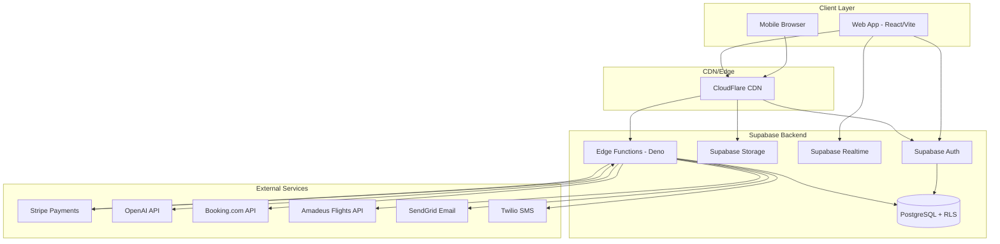

---

## Voice AI Concierge Flow

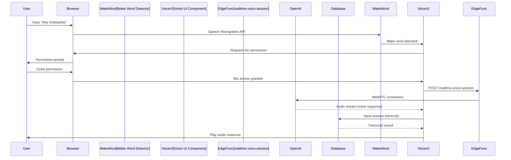

---

## Booking Flow - Agent-Assisted vs Self-Service

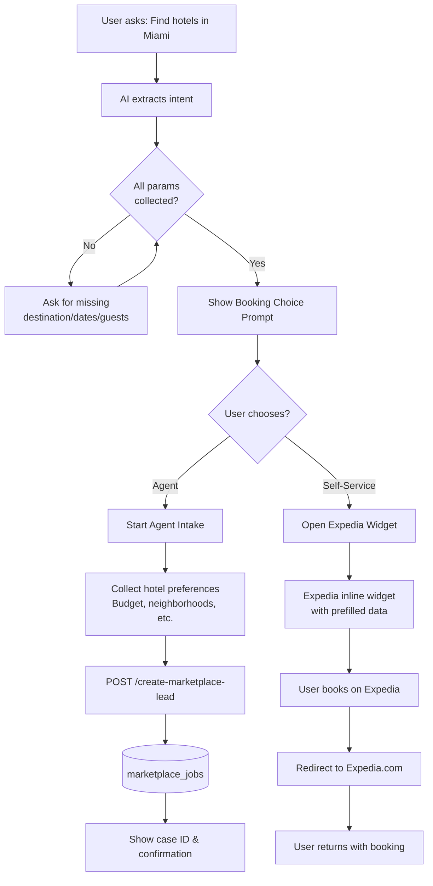

---

## Marketplace Payment Flow with Milestones

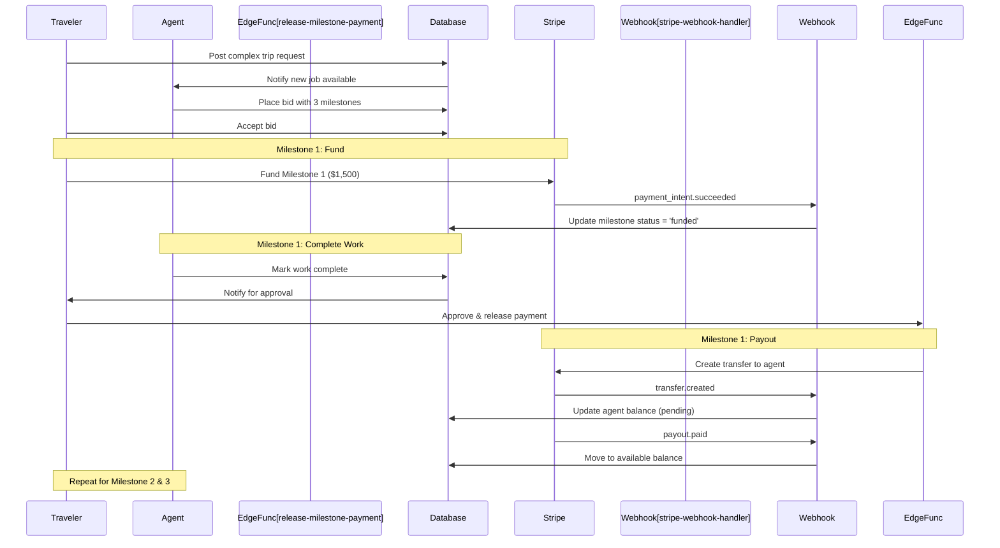

---

## Group Booking Split Payment Flow

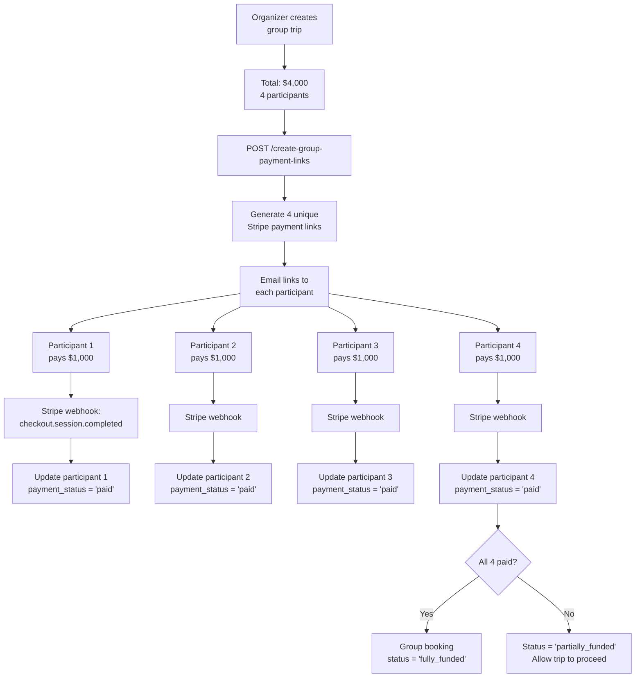

---

## Creator Monetization & Payout Flow

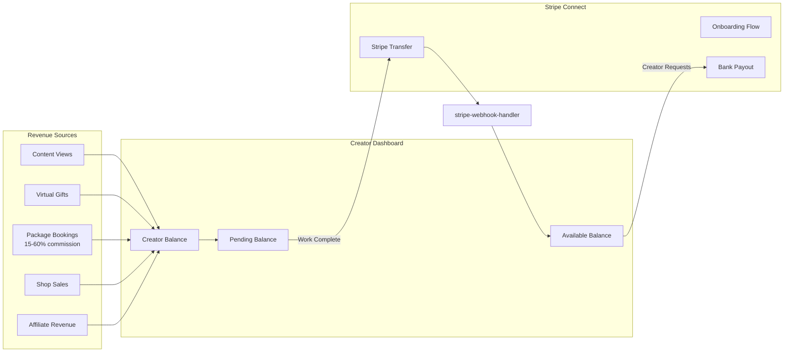

---

## Real-time Communication Flow

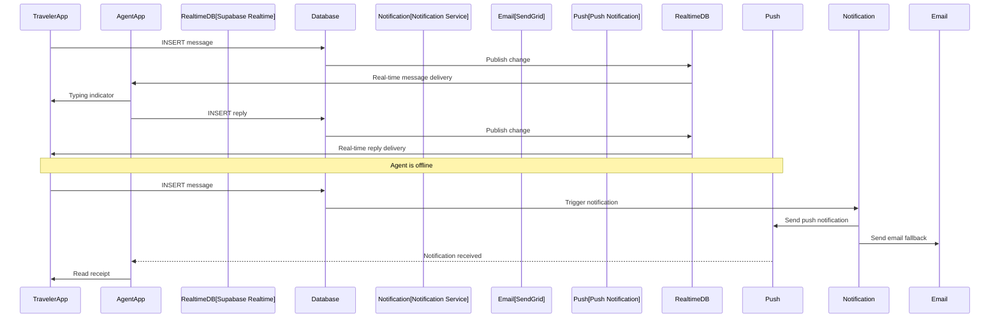

---

## Itinerary Management & Calendar Sync

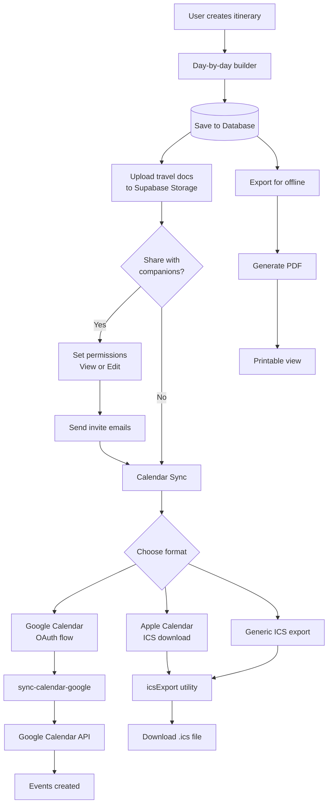

---

## Webhook Processing with Idempotency

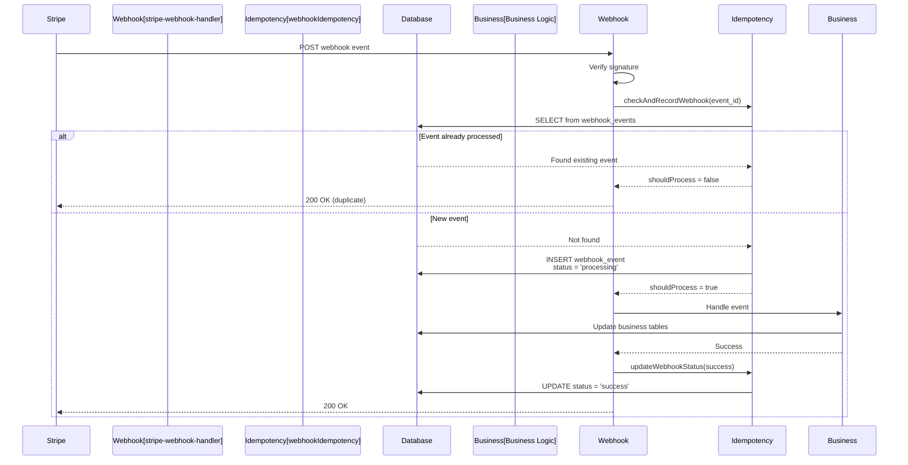

---

## AI Preference Learning System

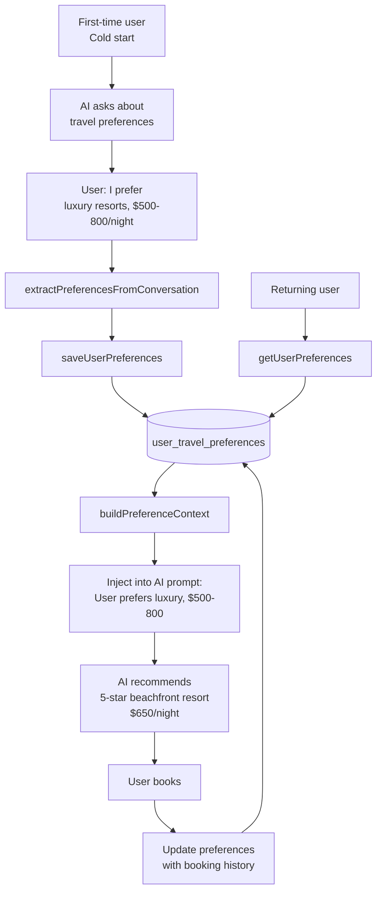

---

## Error Tracking & Observability

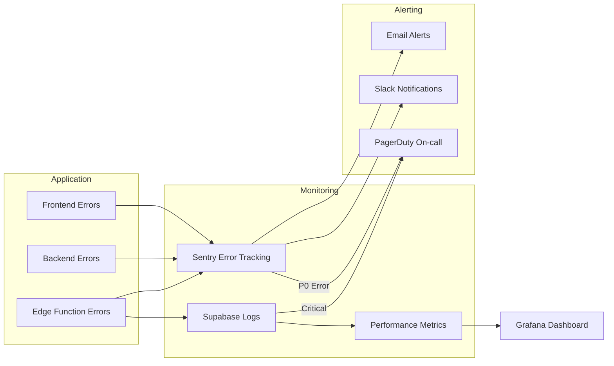

---

## Authentication & Authorization Flow

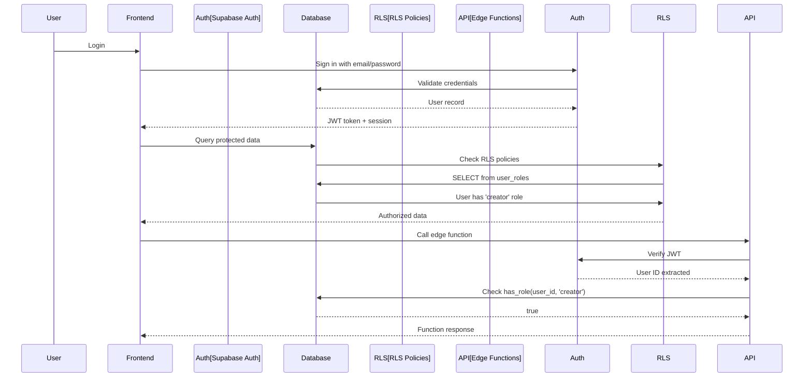

---

## Deployment Pipeline (CI/CD)

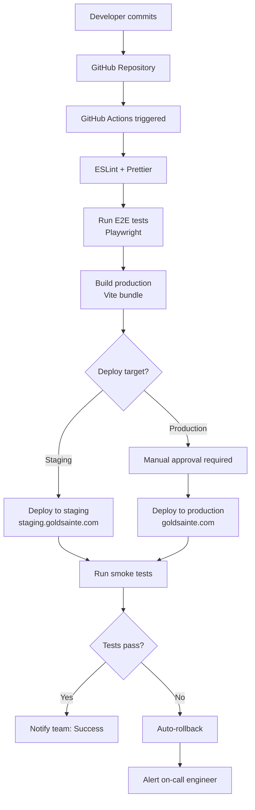

---

## Data Flow Summary

### Critical Paths
1. **Voice Activation:** User → Browser → Wake Word → Voice UI → OpenAI → Database
2. **Booking Choice:** User → AI Chat → Intent Extraction → Choice Prompt → Agent/Expedia
3. **Marketplace:** Traveler → Job Post → Agent Bid → Milestone Fund → Work Complete → Release → Payout
4. **Group Booking:** Organizer → Create Trip → Generate Links → Participants Pay → Track Status
5. **Creator Payout:** Revenue Sources → Balance Tracking → Stripe Connect → Bank Transfer

---

**Last Updated:** 2025-11-11  
**Version:** 1.0
