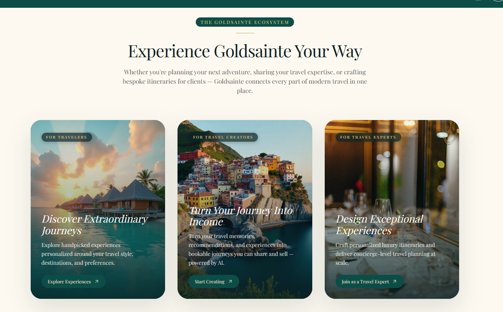
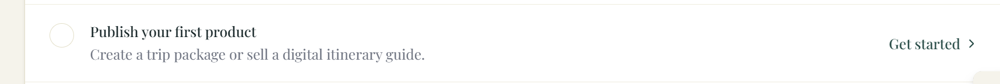

# Goldsainte — Press-Launch Iteration

> **Press release: Wednesday 1 July 2026.** Expect ~300–500 visitors — **mostly travellers**
> looking for holiday packages, plus some travel agents and travel creators (influencers).
> Direction refs: [business](goldsainte_business.md) · [marketing](goldsainte_marketing.md)

---

## 🔁 Re-test before production — branch `improvements`

> `improvements` branched from `main` (production). Everything below is **not yet in prod** — re-test
> on this branch, then merge to `main` and redeploy (`send-direct-message` needs a redeploy).

### Commits on this branch (newest first)
| Commit | Change | Areas to re-test |
|--------|--------|------------------|
| `ac74bef6` | Authed "Ask a Question" + proposal "Message" → dm-model; `send-direct-message` now resolves the responder from `tripId`. Also `HomeHero` `fetchpriority` fix. | 1) **Logged-in** "Ask a Question" on a trip page → conversation appears in the inbox. 2) **Proposal "Message"** button opens a chat. 3) **Normal in-app DM** (creator↔traveller) still works — `send-direct-message` is shared. 4) **Anonymous** Ask (drawer → magic link) still works. 5) Homepage hero renders, no `fetchPriority` console warning. |
| `56b8b86d` | **Reply-notification loop** — a responder reply in an inquiry thread emails the traveller a passwordless link (`action=open`), debounced. Inlined into `send-direct-message` + `reply-notification` template + `AuthCallback action=open`. | 1) As the **concierge/responder**, reply in an inquiry conversation → the **traveller gets an email**; clicking it opens that thread. 2) **Debounce**: a 2nd responder reply within ~15 min sends **no** new email. 3) A reply in a **normal (non-inquiry) DM** sends **no** email. 4) Traveller replying to themselves sends no email. *(Resend = real email, not Inbucket.)* |
| _(B4)_ | **Creator surfaces polish** — tab scrollbar hidden, welcome modal above the nav, profile fonts. | 1) `/creator-dashboard` tab strip has **no OS scrollbar**; tabs still scroll. 2) First load: the welcome modal sits **above** the green nav (top not clipped). 3) `/creators/<id>`: ABOUT bio reads larger; "Member since" legible. |
| _(A3)_ | **Scanner-safe `/auth/verify`** — click-to-complete (no auto-verify on page load). | 1) Ask a question (or reply as concierge) → open the email link → it lands on a page with a **button**; clicking signs you in + opens the conversation. 2) The link still works after the email client/scanner previews it (token not pre-consumed). 3) Signup-confirmation + password-recovery links still work via the button. |
| _(B1)_ | **Registration de-loop** — `CompleteProfile` pre-selects the existing role. | 1) Register as a **creator** (esp. via **Google**) → at "Complete Your Profile" the **Creator** role is **already selected** + name prefilled; just confirm → Continue (no re-pick). 2) Email signup with a name → does **not** hit complete-profile at all. |
| _(B3)_ | **Creator Trips tab + first-product checklist** — `CreatorTripsTab` now lists the creator's `packaged_trips` (any status, with badge); checklist counts `pending_review`+`published`. | 1) As a **creator**, build a trip → it **appears in the Trips tab** of `/creator-dashboard` (with an "In review" badge). 2) "Publish your first product" Getting-Started item **ticks** after publishing. 3) A draft (autosave only) does **not** tick it. |
| _(analytics)_ | **Env-driven GA4 / Clarity / GSC-Bing verification / Ads label** (`src/lib/analytics/init.ts`, `main.tsx`, CSP, `vite.config.ts`). No-op until env vars set. | 1) App loads with **no** new console/CSP errors when vars are **unset**. 2) With `VITE_GA4_MEASUREMENT_ID` + `VITE_CLARITY_PROJECT_ID` set → GA4 + `clarity.ms` scripts load (Network tab), no CSP block. 3) Existing Google Ads tag still loads. |

### Regression checklist (Ask-a-Question end-to-end)
- [ ] Anonymous: submit → email → magic link → land in conversation, **single** message (no dup), correct trip + concierge label.
- [ ] Logged-in: Ask on a trip page → conversation in inbox immediately; responder = concierge/creator.
- [ ] Platform/concierge trip → `responderId` is **not null** in the `submit-trip-inquiry` / `send-direct-message` logs.
- [ ] Phone reuse doesn't break signup ("Database error saving new user" gone).
- [ ] Existing creator↔traveller DMs and message-requests still send/accept normally.

### Deploy after re-test passes
1. Merge `improvements` → `main`.
2. Redeploy edge functions: **`send-direct-message`** (responder resolution); `submit-trip-inquiry` if not already current.
3. Lovable rebuilds the frontend from `main`; smoke-test on `goldsainte.ai`.

---

## Audiences & journeys

### Travellers — primary press audience
Assumed journey:
1. Land on the homepage 
2. Scroll, then explore curated packages, e.g. https://goldsainte.ai/marketplace/trip/cape-town
3. Some ask a question / post a trip request.

**Critical-thinking feedback (acted on / still open):**
- The press visitor is overwhelmingly a **traveller** → optimise the top of the homepage and the
  trip pages for them; treat creators/agents as a secondary, lower-funnel capture.
- **Lower hero friction** — lead with "explore", not a signup wall.
- **Two segmentation sections** ("Two Ways to Experience" vs "Experience Goldsainte Your Way")
  sit back-to-back and blur together — disambiguate or merge.
- **Instrument before launch** — one press shot; without analytics the spike teaches us nothing.

### Travel agents / creators — secondary
- They find their section on the landing page ("Experience Goldsainte Your Way") 
  and register.
- **Registration is too complex** — it loops the user through email → type → details → … . Needs a
  review and a simpler flow.
- **Studio / profile / post-an-itinerary layout** needs polish (see Workstream B).
- **Goal:** the "first product" from onboarding  works **end to end** and
  creates a trip that **shows in the Trips tab** of `/creator-dashboard`.

---

## Workstream A — Traveller "Ask a Question" inquiry flow

> Status as of **2026-06-27**: core flow shipped to prod and working. Detailed history + the
> F1–F11 resolutions live in [ask_question.md](../features/ask_question.md).

### ✅ Done
- Submit → conversation created **server-side on submit** (send-on-submit) in the
  `dm_conversations` / `direct_messages` model the inbox actually reads.
- Concierge routing (package `creator_id`/`agent_id` → `CONCIERGE_USER_ID` fallback; prod secret set).
- Optional name/phone (with the `profiles_phone_unique` collision fix), reframed email + concierge
  label, inbox layout (viewport-fit, internal scroll), duplicate-message guard, prod build fallback.
- Deployed live; verified working.
- **Logged-in "Ask a Question" + proposal "Message"** now route through `send-direct-message`
  (dm-model); the responder is resolved server-side from `tripId` (creator/agent/`CONCIERGE_USER_ID`),
  so authed travellers' questions show in the inbox. *(needs `send-direct-message` redeploy)*

### ⏳ Remaining
1. ✅ **BUILT — Reply-notification loop** (inlined into `send-direct-message`, not a separate
   `notify-inquiry-reply` function). Responder reply in an inquiry thread → debounced (~15-min burst)
   passwordless email → `action=open` opens the thread; `reply-notification` template added.
   **Re-test (see top); redeploy `send-direct-message`.** *Fast-follow:* scanner-safe magic links (Q1).
2. ✅ **DONE — Logged-in "Ask a Question" + proposal "Message"** rerouted through
   `send-direct-message`; responder resolved server-side from `tripId`. *(redeploy `send-direct-message`)*
3. **Launch hardening for public traffic.**
   - ✅ **Scanner-safe magic links (Q1)** — `/auth/verify` is now **click-to-complete** (`AuthVerify.tsx`):
     the token is spent only on a real button click, so scanner GET-prefetch can't burn it ("link expired").
     Covers the submit email, the reply email, and signup confirmation.
   - ⏳ **Bot/captcha (Q6):** the drawer is public and creates auth accounts. Add Turnstile + verify
     server-side; clean up never-converted `auth.users`. *(Needs a Turnstile account — you're checking.)*
4. **Analytics (F10):** `inquiry_submitted` / `inquiry_converted` events — measure the one press shot.
5. **Secondary:** privacy note at submit (Q9); schedule `expire_old_pending_inquiries` via pg_cron (F9).

---

## Workstream B — Creator / agent registration & studio

### B1. Simplify the registration flow
Traced (2026-06-27):
- ✅ **#1 already in place** — email signup passes `first_name`/`last_name`/`full_name`/`account_type`
  into metadata (`Auth.tsx:453`), so a complete email signup **skips the completion gate** entirely.
- ✅ **#2 — no more role re-ask** — `CompleteProfile` now pre-selects the role the user already chose
  (passes the existing `account_type` as `AccountTypeStep` `defaultType`), so the screen confirms
  identity instead of re-asking the role. (`AccountTypeStep` already prefills the name from Google.)
- ⏳ **Optional (not done — would over-correct):** counting `full_name` in AuthCallback `hasIdentityFields`
  would let OAuth users skip `complete-profile` entirely, but then generic Google sign-ins (no role
  chosen) default to traveler with no prompt. Decide if desired.

### B2. Creator dashboard layout & fonts — polish (reviewed)
`/creator-dashboard` reads slightly thin / "admin panel" and is **narrower than the rest of the app**,
which fights the premium positioning the studio is selling creators on.
- [x] **Match width:** `max-w-5xl` → `max-w-6xl` in `CreatorDashboard.tsx` (matches the marketplace).
- [x] **Promote section headers:** Portfolio tab "Photos, Videos & Reels" / "Social Accounts" → serif
      `text-lg md:text-xl font-secondary` (+ their descriptions `text-xs` → `text-sm`).
- [x] **Un-cramp the intro:** "Welcome, Creator" subtitle → `text-base …/70 max-w-xl`.
- [x] **Lift body legibility:** footer/body `text-sm …/65` → `text-[15px] …/70`.
- Leave alone (intentional editorial style): the `text-[10px]` uppercase eyebrows, the
      `text-[28px] md:text-4xl` H1.

### B3. First product end-to-end
The "first product" onboarding step must create a real trip that appears in the **Trips tab** of
`/creator-dashboard`.
- ✅ **Trips tab now lists trips** — `CreatorTripsTab` was a stub (no query); it now queries
  `packaged_trips` by `creator_id` (all statuses) with a Draft / In review / Live badge.
- ✅ **Checklist** "Publish your first product" now counts submitted trips (`pending_review` +
  `published`) — was `published`-only, so it never ticked (creator trips go to review).
- ⏳ **Open product decision:** trips go to `pending_review` (admin approval) before they're publicly
  bookable. Decide auto-approve / fast-track vs manual review for the launch.

### B4. Creator surfaces polish (from `next.md`)
- ✅ **Tab strip scrollbar** — `/creator-dashboard` tabs showed an always-visible OS scrollbar + a
  stray vertical bar. Hidden the native scrollbar (`overflow-y-hidden [scrollbar-width:none]
  [&::-webkit-scrollbar]:hidden`); tabs still scroll (trackpad/swipe, active tab scrolls into view).
  Mobile already uses a `Select` dropdown.
- ✅ **Welcome modal under the nav** — `OnboardingWelcomeModal` rendered at `z-50` (same as the sticky
  header) so the nav covered its top. Now **portaled to `document.body` at `z-[100]`**.
- ✅ **"Skip for now" / "A space reserved…" — kept secondary (decision):** they must not compete with
  the primary CTA. Only bumped "Skip" `text-[12px]` → `text-sm` for tappability; the italic caption
  stays small (intentional editorial flourish).
- ✅ **Public profile fonts** — ABOUT bio `text-base/lg` → `text-lg/xl` (the creator's voice gets
  presence); "Member since" meta `text-xs` → `text-sm`. Pills/eyebrows left as intentional secondary.
- ✅ **Public profile top-nav consolidated** — `/creators/<id>` had **3 stacked bars** (global nav +
  Back bar + Owner banner) with a **duplicated "Edit profile"**. Merged into **one** bar:
  Back · "Owner view" chip · single **Edit profile** · ··· (copy link / public preview). Removed the
  redundant strip + the dup; content sits higher. *(Optional follow-up: overlay Back/··· on the hero
  for a fully content-forward look.)*
- ✅ **Focus outline (app-wide)** — root cause was the global `--ring` token being **black**
  (`index.css:229`), so **every** shadcn button's focus ring was a dark box (e.g. the profile-toolbar
  `···`, image-7). Set `--ring` → **brand gold (`42 47% 58%`)** — softens every focus ring app-wide.
  The two top-bar icon buttons (profile + bell) still re-showed a ring after a Radix menu closed (focus
  returns to the trigger, image-6), so they now use a **background cue** (`focus-visible:bg-…`, ring-0)
  instead of a ring — no lingering box, keyboard nav still gets a visible state.
- ✅ **Home Base autocomplete** (`/onboarding/creator`, commit `657c70b1`) — `GoogleCityAutocomplete`
  (Google Places, `(cities)`) replaces the plain Home Base input; selecting a city saves to
  `profiles.home_base`. Graceful plain-text fallback when no key is set.
  - 🐞 **Env-var name mismatch (fixed)** — components read `VITE_GOOGLE_MAPS_API_KEY`, but `.env.example`
    + the env validator document **`VITE_GOOGLE_PLACES_API_KEY`** (what the user set). Components now read
    `VITE_GOOGLE_PLACES_API_KEY` **first**, falling back to `VITE_GOOGLE_MAPS_API_KEY`
    (`GoogleCityAutocomplete` + `DestinationAutocomplete`); added the Places key to the vite.config
    `define` block (for prod) + a dev `console.warn` when neither is set. One Google key (Places API +
    Maps JS) covers both.

#### Social handle normalization (acted on)
Handles were stored raw — incl. a leading `@`, which the `@yourhandle` placeholder *invited* — but the
profile link-builders assume a **bare** handle, so a stored `@` produced **broken links**
(`tiktok.com/@@x`, `instagram.com/@x`) and a doubled `@x` display.
- ✅ New **`src/lib/socialHandles.ts`** (`normalizeHandle` / `atHandle` / `socialUrl`) — single source of
  truth: strips `@`, whitespace and pasted profile URLs to a bare handle, and builds per-platform URLs
  (TikTok adds `@`, IG/YouTube don't).
- ✅ Applied **defensively at render** — `AgentPublicProfilePage`, `CreatorMediaGallery` — which repairs
  any existing `@…`/full-URL rows **with no migration**.
- ✅ **On save + load** in creator onboarding (`normalizeHandle`); the two handle inputs now show a fixed
  grey `@` adornment so creators type the bare handle (zero ambiguity).
- ↪️ *Follow-up (optional):* the settings editors (`CreatorSocialAccountsEditor`, `CreatorSettingsPage`)
  still store full URLs — links render fine (the builders normalize), but their stored format differs.

#### Profile vs landing-page review (acted on)
Same palette/type as the landing page, but flatter/sparser. Implemented:
- ✅ **#1 Hero trust panel** — the cover hero wasted ~⅔ of its width; added a desktop "at-a-glance"
  panel (response time + specialties) beside the identity card. Gracefully hidden when the creator has
  neither (so the empty test profile shows no change — it activates for filled profiles).
- ✅ **#2 Tighter rhythm** — content sections `py-16 md:py-20` → `py-12 md:py-16` (less cavernous).
- ✅ **#3 Curated Journeys** — the profile now fetches the creator's **published `packaged_trips`** and
  renders a card grid linking to `/marketplace/trip/<slug>`. Previously the page only surfaced guides +
  TikTok, so a creator's actual bookable products never showed. Hidden when there are no live packages.
- ⏸️ **#4 De-emphasise "NEW DESIGNER" for visitors** — not done (you didn't select it).
> Note: #1 + #3 only render with real data (specialties / response time / published trips). To see them
> on Creator 001, give it a specialty + a published trip package; otherwise only #2 is visible.

### B5. Creator-onboarding friction (from `next.md`) — assessment, **pending decisions**
Wizard is **5 steps**: 1) About You · 2) Social Profile · 3) Your Niche · 4) Portfolio · 5) Standards
(Stripe + legal). Two issues raised; reduce friction for non-technical influencers.

**(a) Step 3 — "Primary Destinations" clunky — ✅ DONE.**
- Was `DestinationAutocompleteNominatim` (free OpenStreetMap) — frequently showed **"Can't reach
  suggestions"** (rate-limits / CORS), with a pin icon overlapping the placeholder + heavy border.
- ✅ Swapped to **Google Places multi-select** (`DestinationAutocomplete`, on `VITE_GOOGLE_PLACES_API_KEY`)
  → reliable suggestions, no "Can't reach" fallback. The `MapPin` now sits beside the label (no overlap),
  with a live `n/10` count. Added an `inputClassName` prop and matched the onboarding input style
  (`border-[#E5DFC6]` + gold focus + `rounded-xl`). Made the field **optional** (`canProceed` case 2 no
  longer requires `destinations`; label `*` removed). `DestinationAutocompleteNominatim` no longer used here.

**(b) Step 4 — "Portfolio" — remove to cut friction.**
- Longest, densest step and **entirely optional**: cover image, featured photos, content gallery,
  **brand-tier prefs, preferred hotel brands, aesthetic style, pricing model**.
- Cover + photos are **already editable in the dashboard Portfolio tab** → safe to drop from onboarding.
  **Brand alignment + pricing model have NO other edit surface** (set only here) → dropping them leaves
  them at DB defaults until a settings screen exists.
- ✅ **(b) Step 4 HIDDEN (reversible)** — gated behind `SHOW_PORTFOLIO_STEP = false` in
  `CreatorOnboardingPage.tsx` (wizard now 5→4 steps). All of Step 4's JSX, state, and save fields stay
  intact; flip the flag to `true` to restore instantly. Step indices are derived from the flag
  (`STANDARDS_STEP_INDEX = STEPS.length-1`), and `canProceed` was made index-aware. Audit conclusion
  stands: hiding it loses nothing the app reads (brand-alignment + pricing are write-only dead data;
  cover/photos live in the dashboard Portfolio tab).
- 📌 **TODO — decide after partner tests the 4-step flow:** completely **remove** Step 4, or
  **re-do/improve** it (e.g., a slim cover-image prompt in an existing step + move brand/pricing to a
  future Settings screen if they ever become real features). Partner to report anything important now
  missing.

### B6. Creator dashboard tabs — follow-up (from `next.md`, image-9)
The B4 scrollbar fix worked (no OS scrollbar). Remaining critical-thinking notes:
- ⚠️ **Overflow discoverability** — 11 tabs still overflow (`CONTENT` / `EARNINGS` / `SETTINGS`
  off-screen); with the scrollbar hidden the only cue is the clipped "EA…" at the edge. Add a subtle
  **right-edge fade** (+ optional chevron) shown only when the strip overflows. *(Low-risk; offered.)*
- 💭 **IA load** — 11 top-level tabs is heavy for non-technical influencers. Consider consolidating
  (groups or a "More" overflow menu) — larger change, **post-launch**.

### B7. Getting-Started checklist linkage audit (from `next.md`, image-10)
Audited the 6 **creator** items in `GettingStartedChecklist.tsx` — only **2 of 6** reflect real state:
- #2 Connect payout (`stripe_*account_id`) ✅ · #3 Publish product (trips/guides count) ✅.
- ✅ **#1 Complete profile** — now checks **real content** (`avatar_url && bio && creator_niches?.length`)
  instead of the `has_completed_creator_onboarding` wizard flag, so a filled profile ticks even if the
  creator hit *Skip* on the last onboarding step.
- ✅ **#4 Share profile** — was `creator_avg_views > 10` (imported TikTok metric). Now **completes when
  the creator opens their public profile** (clicking *View my profile* sets `gs_shared_profile_<id>` in
  localStorage + ticks immediately; persisted across reloads, like the marketplace-browse item).
- ↪️ **#6 Set notifications** — left as-is (`!!notification_preferences`); harmless false-positive.
- ↪️ **#5 Review tax** — left informational (`() => false`); the checklist is still dismissable via ✕.
  *(If we want it to reach 6/6 / auto-hide, make #5 complete-on-click too — small follow-up.)*

---

## Workstream C — Marketplace data hygiene (quick, high-visibility)
Press visitors browse the marketplace, so:
- [ ] **Remove the live test package** `zzz-test-deposit-flow` ("TEST — Deposit Flow (delete me)").
- [ ] **De-duplicate destination listings** — several appear twice with different slugs
      (cape-town / cape-town-winelands, santorini ×3, kyoto ×2, amalfi-coast ×2, patagonia ×2,
      bali ×2, marrakech ×2, swiss-alps ×2). Decide which to keep, archive the rest.

---

## Workstream D — Analytics, SEO & campaign tracking

Audit (2026-06-27): only the **Google Ads** tag is wired; GA4, Clarity, GSC and Bing are all missing.

### Current state
- ✅ **Google Ads** gtag (`AW-17180504737`) loads in `index.html`; `src/lib/analytics/conversions.ts`
  fires purchase conversions — **but the conversion label is a placeholder**
  (`REPLACE_WITH_LABEL_FROM_GOOGLE_ADS`), so **conversions aren't actually recorded yet**.
- ❌ **GA4** — not configured (no `G-XXXX` property). The GA4 `purchase` event in `conversions.ts` is a
  no-op until one exists. CSP already allows GA / Tag Manager.
- ❌ **Microsoft Clarity** — not integrated.
- ❌ **Google Search Console** — no verification (no `google-site-verification` meta).
- ❌ **Bing Webmaster** — no verification (no `msvalidate.01` meta).

### To do — code
- [x] **Env-driven setup shipped** (`src/lib/analytics/init.ts` + `main.tsx` + CSP + `vite.config.ts`).
      GA4, Clarity, GSC/Bing verification, and the Ads conversion label all activate purely by setting
      their env var — **no further code change needed**, just the IDs below.
- [x] **GA4 events** (A4): `inquiry_submitted` / `inquiry_converted` / `sign_up` fired via
      `src/lib/analytics/events.ts` (no-op until the GA4 id is set). `page_view` is automatic.
- [ ] **Sitemap:** confirm `https://goldsainte.ai/sitemap.xml` is served; submit to GSC + Bing.

### To do — accounts/dashboards (you) → then set the env var (Lovable build env + `.env.local`)
- [ ] Create the **GA4 property** → `VITE_GA4_MEASUREMENT_ID` = `G-XXXXXXX`.
- [ ] Create a **Clarity** project → `VITE_CLARITY_PROJECT_ID`.
- [ ] **Google Ads** conversion action → `VITE_GOOGLE_ADS_CONVERSION_LABEL`.
- [ ] **GSC**: verify via GA4-link/DNS (no code) *or* set `VITE_GSC_VERIFICATION`; submit sitemap.
- [ ] **Bing**: import from GSC (no code) *or* set `VITE_BING_VERIFICATION`; submit sitemap.

> The code is in place and env-driven — just set the vars (Lovable build env for prod, `.env.local`
> for local) and the tags light up. No redeploy of code needed beyond a normal Lovable rebuild.

---

## Next iteration — prioritised plan for Wednesday

### P0 — must land before press (traveller-heavy traffic)
- [ ] **C** — Marketplace cleanup: drop the test package + dedupe destinations *(fast, high visibility)*.
- [x] **A2** — Logged-in "Ask a Question" path ✅ *(done; needs `send-direct-message` redeploy)*.
- [~] **A3** — Hardening: scanner-safe magic links ✅; captcha on the public drawer ⏳ *(needs Turnstile)*.
- [ ] **D / A4** — Analytics & SEO foundation: GA4 + Microsoft Clarity + GSC/Bing verification + sitemap,
      plus the `inquiry_submitted` / `inquiry_converted` events *(needs IDs from you — see Workstream D)*.
- [x] **A1** — Reply-notification loop ✅ *(built on `improvements`; re-test + redeploy `send-direct-message`)*.

### P1 — creator/agent experience (they register from the press too)
- [x] **B1** — De-loop registration ✅ *(complete-profile pre-selects the chosen role; #1 metadata already in place)*.
- [x] **B2** — Creator dashboard width + serif section headers + intro/body legibility ✅.
- [x] **B3** — First product → shows in Trips tab ✅ *(Trips-tab query + checklist fix; auto-approve-vs-review decision still open)*.
- [x] **B4** — Creator surfaces polish: tab scrollbar hidden, welcome-modal z-index, profile fonts ✅.

### P2 — secondary / after launch
- [ ] **A5** — Privacy note at submit; schedule the inquiry-expire pg_cron job.
- [ ] Clean up never-converted `auth.users`.
- [ ] Homepage: lower hero friction + disambiguate the two segmentation sections.

> Recommendation: do **A2 + C** (cheap, high-impact) and stand up **analytics** first, then the
> **reply loop (A1)** and **hardening (A3)** before driving traffic. Creator polish (B) slots just
> under the traveller work since travellers dominate the press audience.
